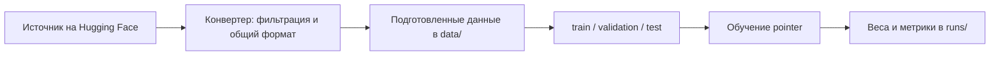

# Как устроены датасеты и обучение

Этот документ объясняет текущую реализацию `krasivo-jev` и правила отбора данных.
Основные требования к корпусу записаны в [AGENTS.md](../AGENTS.md).
Русскоязычные источники, фильтры, разделы и условия использования описаны в
[russian-datasets.md](russian-datasets.md).

## Главный критерий отбора

Правильный ответ должен следовать из предоставленного контекста и вопроса.
Модель должна учиться понимать текст, применять правила и выбирать ответ.
Примеры, требующие внешних фактических, культурных или экспертных знаний, не подходят.

Например, вопрос «Какая столица Франции?» без контекста проверяет знание факта.
Если в контексте написано «Столица Франции — Париж», тот же вопрос подходит.

Обычное понимание языка и способность рассуждать при этом предполагаются.
Определение тональности отзыва или намерения пользователя — допустимые задачи.
Специфические правила источника и значения категорий следует объяснять в контексте.

## Общий формат примера

Все источники преобразуются к схеме `state → question → options → label`:

```json
{
  "state": "Все красные предметы находятся в коробке. Мяч красный.",
  "question": "Где находится мяч?",
  "options": [
    {"id": "A", "text": "В коробке"},
    {"id": "B", "text": "На столе"}
  ],
  "label": [1.0, 0.0],
  "type": "choice"
}
```

| Поле | Значение |
|------|----------|
| `state` | Текст, факты и правила задачи; пустая строка, если контекста нет |
| `question` | Что нужно определить |
| `options` | Варианты ответа: модель читает `text`, а `id` связывает вариант с разметкой |
| `label` | Целевое распределение вероятностей в порядке вариантов |
| `type` | `noul` для вариантов только `yes/no`, иначе `choice` |

Контракт определён в [utils.py](../src/jev_datasets/utils.py): `SAMPLE_FEATURES` и `make_sample`.
`make_sample` принимает либо идентификатор правильного ответа, либо готовое распределение.
В первом случае получается one-hot: единица у правильного ответа и нули у остальных.

Мягкая разметка сохраняет неоднозначность примера. Например, в
[chaos_nli](../src/jev_datasets/nlu/chaos_nli.py) используются доли голосов аннотаторов.
Это распределение по вариантам, а не набор независимых бинарных меток.

Поле `type` добавляет `JevDataset.add_type()` после конвертации.
Функция `with_context` может дополнять `state` инструкцией и объяснениями категорий ответа.

## Почему одни данные подходят, а другие исключаются

Критерий применяется к источникам, отдельным задачам и строкам.
Поэтому один датасет может подходить лишь частично.

| Источник | Что оставляют или исключают | Причина |
|----------|----------------------------|---------|
| [SciQ](../src/jev_datasets/knowledge/sciq.py) | Оставляют строки с непустым `support` | Без опорного текста нужны научные знания |
| [SpaRP](../src/jev_datasets/spatial/sparp.py) | Исключают `commonsense_question` и вопросы с несколькими правильными отношениями | Первые требуют внешних знаний; вторые не сохраняются как задача выбора всех верных вариантов |
| [HaluEval](../src/jev_datasets/truthfulness/halueval.py) | Используют задачи с исходными фактами, статьёй или контекстом; исключают `general` | Галлюцинацию нужно проверять по предоставленной информации |
| [GitHub issues](../src/jev_datasets/bugs/github_issue_type.py) | Оставляют bug, enhancement, question, documentation; исключают Duplicate и другие метки процесса triage | Метки процесса зависят от информации за пределами текста issue |
| [Support tickets](../src/jev_datasets/classification/ticket_routing.py) | Используют категорию и очередь, исключают приоритет | Приоритет зависит от бизнес-решения, которое текст не определяет |

Согласно AGENTS.md, по причине зависимости от внешних знаний исключены MMLU, ARC,
OpenBookQA, CommonsenseQA, HellaSwag, WinoGrande и наборы предпочтений/judge.

Общей автоматической проверки «можно ли ответить только по контексту» нет.
Это принцип отбора, которым руководствуется автор конвертера, и специальные фильтры для каждого источника.
Например, SciQ проверяет наличие непустого `support`, но не проверяет отдельно достаточность текста для каждого ответа.
Наличие конвертера само по себе не гарантирует, что все оставшиеся строки полностью отвечают этому принципу.

## Дополнительные правила качества

- Удалять строки и разделы без разметки. Например, SST-2 исключает исходный неразмеченный `test`.
- Не допускать, чтобы позиция ответа выдавала правильный вариант; при необходимости перемешивать варианты.
- Для шаблонных вопросов использовать около пяти формулировок и выбирать одну по содержимому примера.
- Делать тексты вариантов понятными человеку; сохранять стабильные идентификаторы отдельно.
- Брать каждый исходный набор только из одного источника, чтобы сборники не создавали утечку между train и test.
- Делать выбор формулировок, перемешивание и выборки воспроизводимыми.

Например, [RuleCollection](../src/jev_datasets/logic/rule_collection.py) используется только для ProntoQA и AR-LSAT:
другие входящие в него наборы берутся из отдельных источников.
SpaRP использует только часть SpaRTUN, поскольку StepGame уже подключён отдельно.
Эти меры не являются универсальной проверкой дубликатов во всём корпусе.

## Подготовка и разбиение данных



Каждый источник описан подклассом `JevDataset` и зарегистрирован в
[jev_datasets/__init__.py](../src/jev_datasets/__init__.py).
Его `prepare()` фильтрует и преобразует исходные строки.

Команда `jev prepare`:

1. Загружает источник с Hugging Face через конвертер.
2. Вызывает `prepare()` и добавляет `type`.
3. Ограничивает каждый исходный раздел — по умолчанию до 10 000 строк.
4. Сохраняет `DatasetDict` в `data/<name>/` или указанный каталог.

Ограничение сохраняет пропорции позиций максимума `label`.
Если варианты перемешаны, это пропорции правильных позиций, а не обязательно семантических классов.
Лимит применяется после загрузки и конвертации источника.

```bash
uv run jev list
uv run jev prepare sst2 anli
uv run jev prepare sciq --max-samples 50 --output-dir /tmp/jev-inspect
```

Перед обучением [jev_model/data.py](../src/jev_model/data.py) приводит исходные разделы к train/validation/test.
Если validation или test отсутствует, каждый недостающий раздел выделяется из train примерно по 5% по хэшу содержимого.
При таком выделении строки с одинаковым `state` остаются вместе; если `state` пуст, используется `question`.
Это предотвращает разделение вопросов по одному и тому же контексту при создании недостающих разделов.
Уже существующие исходные разделы сохраняются: общая функция не устраняет пересечения между ними.
Все модели используют эту функцию, чтобы сравниваться на одинаковых строках.

## Как обучается pointer

Текущая локально обучаемая модель — [pointer](../src/jev_model/pointer/README.md).
Она использует предобученный каузальный декодер Qwen с LoRA-адаптерами и специальной головой выбора ответа.
По умолчанию основные веса Qwen заморожены, обучаются LoRA и голова.
Опция `special_embeddings` дополнительно позволяет обучать строки эмбеддингов служебных разделителей.

Контекст, вопрос и тексты всех вариантов собираются в одну последовательность:

```text
<state> контекст <q> вопрос <opt> вариант 1 </opt> <opt> вариант 2 </opt> ... <decide>
```

Qwen обрабатывает последовательность за один проход.
Голова сравнивает скрытое представление позиции `<decide>` с представлением конца каждого варианта
и получает его оценку. Из оценок вычисляются вероятности ответов.
Число вариантов может различаться между примерами; ответ не генерируется как текст.

Основная стадия `ce` использует мягкую перекрёстную энтропию:
предсказанные вероятности должны совпадать с `label`.
В [train.py](../src/jev_model/pointer/train.py) при перестановке вариантов вместе с ними переставляется разметка.

Особенности обучения:

- При каждом показе примера варианты перемешиваются воспроизводимым образом.
  Это снижает зависимость от позиции, но не делает предсказания строго независимыми от порядка вариантов.
- При стандартном `sampling=weighted` датасеты выбираются пропорционально `число строк ** alpha`.
  По умолчанию `alpha=0.5`, поэтому крупные источники получают больше показов, но не прямо пропорционально размеру.
- Режим `sampling=sized` проходит по всем примерам эпохами; смешивание тогда определяется размерами наборов.
- Иногда удаляются неверные варианты или правильный вариант заменяется на `None of the above`.
  Эти преобразования применяются к обучающим примерам с одним правильным ответом; validation и test не меняются.
- Длинный контекст обрезается в середине. Пример пропускается, если вопрос и варианты сами не помещаются в лимит.

Лучшие веса выбираются по средней NLL на validation с равным весом каждого датасета.
Затем на полной validation подбирается температура для калибровки вероятностей.
Температура меняет уверенность, но не вариант с максимальной оценкой.
Test используется для отдельной итоговой оценки.

В коде есть дополнительная стадия `rl`, но она не включена по умолчанию.
README модели указывает, что используемые здесь runs обучаются только с `ce`.

Каждый run сохраняет конфигурацию, завершённые стадии, адаптеры, голову, историю обучения и метрики в `runs/`.
Основные метрики — accuracy, macro precision/recall/F1, NLL и ECE.
NLL и ECE помогают оценивать качество вероятностей, а не только долю правильных ответов.

## Что важно различать при чтении репозитория

AGENTS.md описывает идею encoder-only модели, однако текущий `pointer` реализован на каузальном декодере Qwen.
Один проход для выбора ответа сохраняется, архитектура отличается от вводного описания.

[typesafe](../src/jev_model/typesafe/README.md) и
[zero_shot](../src/jev_model/zero_shot/README.md) используются для сравнения.
Они локально ничего не обучают: команда `train` записывает конфигурацию, а `eval` оценивает ответы внешней модели.

Требование отвечать по контексту относится к устройству корпуса и задаче обучения.
Оно само по себе не устраняет знания, уже полученные Qwen при предобучении,
и не гарантирует, что модель никогда не воспользуется ими при предсказании.
